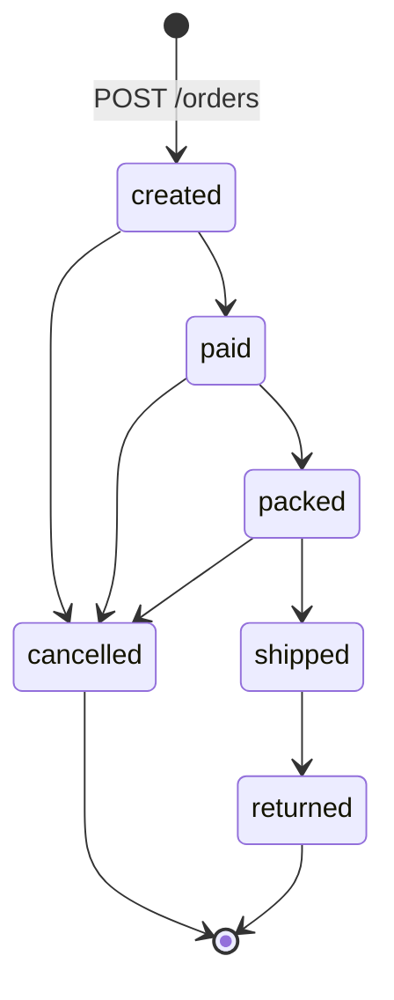

# Nogal — P7 Products & Inventory API

Backend de ecommerce de **ropa masculina** sobre **Laravel 12**. API REST, sin frontend.

Proyecto P7 de la Sesión 14 del curso de Ingeniería de Contexto con sistemas de IA.
Se trabaja **docs-first**: la documentación es la especificación y el código es su
consecuencia.

---

## API en vivo

La API Laravel esta desplegada en **https://nogal-api.onrender.com** (Render, capa
gratuita: la primera peticion tras un rato de inactividad tarda ~30-60 s en despertar
el servicio; la base se resiembra en cada arranque, asi que el catalogo demo siempre
esta en su estado canonico).

```bash
curl -s "https://nogal-api.onrender.com/api/v1/products?per_page=3" -H "Accept: application/json"
```

La raiz (https://nogal-api.onrender.com) sirve la pagina de bienvenida de Laravel. El
despliegue esta definido en `Dockerfile` + `render.yaml`.

---

## Arrancar en local

Requisitos: PHP 8.2 o superior y Composer.

```bash
composer install
cp .env.example .env
php artisan key:generate
php artisan migrate --seed
php artisan serve
```

La API queda en `http://localhost:8000/api/v1`.
El seeder imprime en consola un token de administración para probar la zona `/admin`.

```bash
php artisan test
```

---

## La demo en cuatro peticiones

```bash
curl -s "http://localhost:8000/api/v1/products?in_stock=true&per_page=3" -H "Accept: application/json"
```

```bash
curl -s -X POST "http://localhost:8000/api/v1/carts" -H "Accept: application/json"
```

```bash
curl -s -X POST "http://localhost:8000/api/v1/carts/TOKEN_DEL_CARRITO/items" -H "Content-Type: application/json" -H "Accept: application/json" -d '{"sku":"NGL-CAM-OXF-AZC-M","quantity":2}'
```

```bash
curl -s -X POST "http://localhost:8000/api/v1/orders" -H "Content-Type: application/json" -H "Accept: application/json" -H "Idempotency-Key: 01JBQ9K4N6R8T0V2X4Z6B8D0F2" -d '{"cart_token":"TOKEN_DEL_CARRITO","email":"cliente@ejemplo.com","shipping_address":{"full_name":"Andres Molina","phone":"+57 300 123 4567","line1":"Carrera 45 # 26-30","city":"Medellin","state":"Antioquia","country":"CO"}}'
```

Repite la última con la misma `Idempotency-Key`: devuelve **el mismo pedido** con el
header `Idempotency-Replayed: true` y **no reserva stock por segunda vez**.

El mismo flujo está automatizado en
`tests/Feature/Api/V1/OrderTransitionTest::test_la_demo_completa_del_flujo_de_negocio`.

---

## Qué hay dentro

| Documento | Contenido |
|---|---|
| [docs/architecture.md](docs/architecture.md) | Capas, responsabilidades, trazabilidad, rendimiento |
| [docs/domain/](docs/domain/) | Glosario, catálogo, inventario, carrito, pedidos, modelo de datos |
| [docs/api/contracts/](docs/api/contracts/) | Los 18 endpoints, contrato por contrato |
| [docs/api/openapi.yaml](docs/api/openapi.yaml) | La misma especificación, formal |
| [docs/adr/](docs/adr/) | 10 decisiones con sus consecuencias, incluidas las negativas |
| [docs/test-plan.md](docs/test-plan.md) | Qué se prueba y en qué orden |
| [docs/implementation-checklist.md](docs/implementation-checklist.md) | Estado real del trabajo |
| [docs/S14-evaluacion.md](docs/S14-evaluacion.md) | Las preguntas de la sesión, respondidas |
| [docs/CHANGELOG.md](docs/CHANGELOG.md) | Registro de cambios |

---

## El dominio en una tabla

| Nivel | Pregunta que responde | Ejemplo |
|---|---|---|
| **Producto** | ¿Qué es? | "Camisa Oxford, 100% algodón" |
| **Variante** | ¿Cuál exactamente? | "Azul cielo / M" → `NGL-CAM-OXF-AZC-M` |
| **Existencia** | ¿Cuántas y dónde? | "3 en mano, 1 reservada, en NGL-CEN" |

El stock nunca vive en `products`. Vive en `inventory_items`, que cruza variante con
almacén. `available` es `on_hand - reserved`: **calculado**, nunca una columna.

## El pedido en un diagrama



El stock físico solo se descuenta al **despachar**, no al pagar. Mientras el paquete está
en el almacén, la unidad existe: está reservada, no vendida.

---

## El escaparate

`storefront/` es una landing en Next.js 16 que enseña el catálogo. No es un cliente
de la API en vivo: **Vercel no ejecuta PHP**, así que el catálogo se exporta a un JSON
estático desde la misma base de datos que sirve la API.

```bash
php artisan catalog:export        # genera storefront/src/data/catalog.json
cd storefront && npm install && npm run dev
```

La alternativa era escribir datos de mentira en el frontend, y entonces el escaparate
dejaría de demostrar nada sobre el backend. Los precios, las tallas, los SKU y las
existencias que se ven son los del seeder, calculados con los mismos accesores que usa
`GET /api/v1/products`.

Las fotos de las prendas se generaron con
[claude-banana](https://github.com/Hainrixz/claude-banana) sobre la API de imagen de
Gemini, usando un mismo bloque de estilo para las nueve: fondo de lino cálido, luz suave
desde arriba a la izquierda y una paleta restringida a neutros cálidos más el color de la
prenda. Esa consistencia es la razón de generarlas en vez de bajarlas de un banco: nueve
fotos de nueve fotógrafos distintos no casan entre sí en una parrilla.

No son fotos del producto real — es un proyecto académico y no hay inventario físico
que fotografiar.

### Desplegar en Vercel

Importa el repositorio en [vercel.com/new](https://vercel.com/new) y cambia una sola
cosa: **Root Directory → `storefront`**. Todo lo demás se detecta solo.

| Ajuste | Valor |
|---|---|
| Framework | Next.js (automático) |
| Root Directory | `storefront` |
| Build Command | `npm run build` (automático) |

---

## Alcance del MVP

| Dentro | Fuera, y con su ADR |
|---|---|
| Catálogo con filtros, orden y paginación | Pagos reales — ADR-0007 |
| Inventario por variante y almacén, con libro mayor | Reservas temporales de stock — ADR-0005 |
| Carrito anónimo por token | Cupones y promociones — ADR-0008 |
| Pedidos con idempotencia y máquina de estados | Impuestos y envío calculados — ADR-0008 |
| Ajustes de inventario para administración | Motor de búsqueda real — ADR-0009 |

---

## Estado

| | |
|---|---|
| Laravel | 12.68 |
| Endpoints | 18, todos implementados |
| Tablas | 12 |
| Tests | 80 en verde, 340 aserciones |
| Cobertura de lineas | **94.4%** global, `app/Domain/` por encima del 90% (umbral: 70% / 85%) |
| Escaparate | Next.js 16, contraste AA verificado, sin desbordamiento a 375px |

---

## Trabajar en este repo con Claude Code

`.claude/settings.json` define permisos en tres niveles. `git push`, `git reset --hard` y
`git rebase` están **denegados**; `git commit` y `gh pr create` **preguntan** antes de
ejecutarse.

| Comando | Para qué |
|---|---|
| `/nuevo-contrato <METODO /ruta>` | Contrato antes de implementar |
| `/implementar-endpoint <METODO /ruta>` | Implementación guiada con tests |
| `/nueva-adr <título>` | Registrar una decisión |
| `/revisar-cobertura` | Suite con cobertura contra el umbral |
| `/changelog` | Registrar los cambios pendientes |

| Agente | Cuándo |
|---|---|
| `arquitecto-dominio` | Modelo, agregados, invariantes, estados |
| `redactor-contratos` | Antes de tocar cualquier endpoint |
| `ingeniero-tests` | Después de contratar y después de implementar |
| `escriba-adr` | Cuando se decide algo con consecuencias |
