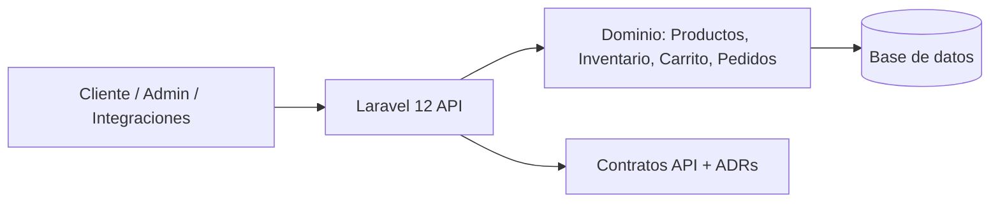
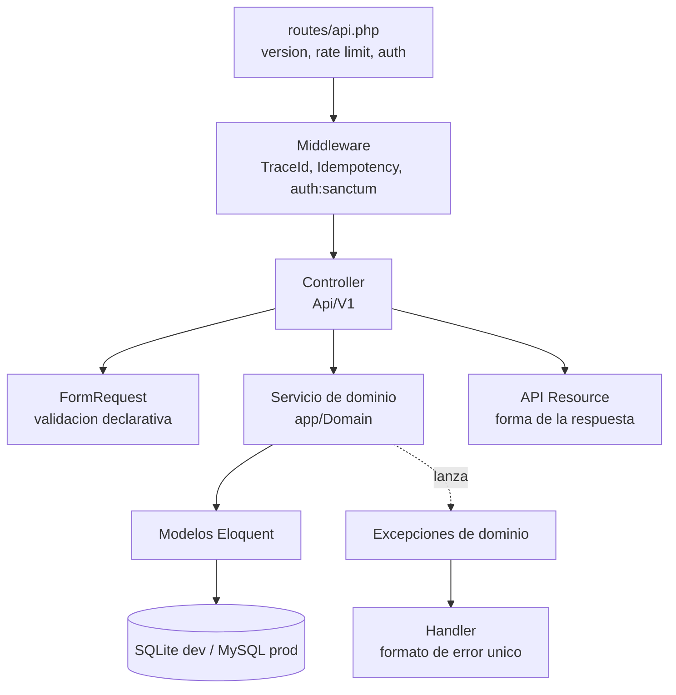

# Arquitectura — Nogal P7

## Visión general



Un backend HTTP sin frontend. Tres tipos de consumidor —tienda, panel de administración e
integraciones— hablan la misma API versionada. La documentación no es un subproducto: es
la especificación de la que sale el código.

## Capas



### Qué hace cada capa, y qué tiene prohibido

| Capa | Responsabilidad | Prohibido |
|---|---|---|
| **Ruta** | Versión, agrupación, rate limit, middleware | Lógica |
| **FormRequest** | Validar forma y tipos del input | Consultar reglas de negocio |
| **Controller** | Recibir, delegar a un servicio, devolver un Resource | Cualquier `if` de negocio, cualquier query |
| **Servicio de dominio** | Reglas de negocio, transacciones, invariantes | Conocer `Request` o `Response` |
| **Modelo Eloquent** | Persistencia, relaciones, scopes, casts | Reglas de negocio complejas |
| **API Resource** | Forma exacta de la respuesta del contrato | Consultar la base de datos (causa N+1) |
| **Handler** | Traducir excepciones al formato de error único | Decidir reglas |

La prueba de que la separación está bien hecha: **un servicio de dominio debe poder
invocarse desde un comando de consola sin tocar nada de HTTP**. Si `CreateOrder` necesita
un `Request`, la capa está mal cortada.

## Estructura de carpetas

```
app/
  Domain/
    Catalog/      ProductQueryService
    Inventory/    InventoryService, StockChecker
    Cart/         CartService
    Ordering/     CreateOrderService, OrderStateMachine
    Shared/       Money, TraceId
  Enums/
    ProductStatus, VariantStatus, CartStatus,
    OrderStatus, MovementType, SizeSystem
  Exceptions/
    DomainException            (base, aporta code + httpStatus)
    InsufficientStockException
    InvalidStateTransitionException
    CartNotModifiableException
    IdempotencyKeyReusedException
  Http/
    Controllers/Api/V1/
    Requests/Api/V1/
    Resources/Api/V1/
    Middleware/
      AssignTraceId
      EnforceIdempotency
  Models/
routes/api.php
database/migrations, factories, seeders
tests/Feature/Api/V1, tests/Unit/Domain
docs/
```

## Trazabilidad

`AssignTraceId` corre **el primero** de la cadena. Genera un ULID, lo guarda en el
contenedor y lo añade al contexto de log de Laravel:

```php
$traceId = (string) Str::ulid();
Context::add('trace_id', $traceId);
$response->headers->set('X-Trace-Id', $traceId);
```

Consecuencias:

- Toda respuesta, tenga éxito o falle, lleva `X-Trace-Id`.
- Toda respuesta de error lo repite dentro del cuerpo, en `error.traceId`.
- Toda línea de log de esa petición lo lleva.

Es lo mínimo para que un reporte de cliente sea accionable. Sin esto, "me falló el pedido
ayer por la tarde" no se puede investigar.

## Manejo de errores

Todas las excepciones de dominio heredan de `DomainException`, que expone `code()` y
`httpStatus()`. El handler las convierte a la envoltura única definida en
`docs/api/contracts/00-convenciones.md`. Ningún controller construye respuestas de error
a mano: si lo hiciera, el día que cambie el formato habría que buscar en 30 archivos.

En producción, una excepción no controlada devuelve `500 INTERNAL_ERROR` con su `traceId`
y **sin** stack trace. El stack trace va al log, indexado por ese mismo `traceId`.

## Autenticación

Laravel Sanctum con tokens Bearer.

| Zona | Acceso |
|---|---|
| `GET /api/v1/products*`, `GET /api/v1/inventory/*` | público |
| `/api/v1/carts*` | público, la propiedad la da el token opaco del carrito |
| `POST /api/v1/orders` | público o autenticado |
| `GET /api/v1/orders` (historial) | autenticado |
| `/api/v1/admin/*` | autenticado + habilidad `admin` |

El carrito anónimo es deliberado: obligar a registrarse antes de añadir al carrito es la
principal causa de abandono en un ecommerce.

## Rate limiting

| Grupo | Límite |
|---|---|
| Catálogo (lectura) | 120 / min por IP |
| Carrito (escritura) | 60 / min por IP |
| Creación de pedido | 10 / min por IP |
| Admin | 300 / min por token |

Superarlo devuelve `429 RATE_LIMITED` en el formato de error único, con `Retry-After`.

## Base de datos

SQLite en desarrollo y pruebas, MySQL 8 en producción (ADR-0010). El riesgo conocido es
que SQLite no aplica algunas `CHECK` igual que MySQL; por eso las invariantes tienen
además su test de dominio y no descansan solo en la base de datos.

## Rendimiento

| Riesgo | Mitigación |
|---|---|
| N+1 al listar productos con variantes | `with(['variants', 'images', 'category'])` obligatorio |
| Filtro `in_stock` sobre 3.000 variantes | subconsulta `EXISTS`, nunca `whereHas` anidado |
| Cálculo del precio efectivo | `COALESCE(variants.price_cents, products.base_price_cents)` en SQL, no en PHP |
| Recuento total en la paginación | `simplePaginate` cuando el contrato no exija `total` |

## Lo que esta arquitectura NO tiene, a propósito

- **Sin repositorios ni interfaces por encima de Eloquent.** Añaden una capa de indirección
  que en un proyecto de este tamaño solo aporta ceremonia. Si algún día se cambia de ORM,
  se paga entonces.
- **Sin CQRS ni event sourcing.** `inventory_movements` da el histórico que necesitamos sin
  el coste operativo de un event store.
- **Sin colas.** Todo es síncrono. Cuando aparezcan correos o webhooks de pago, entra una
  cola y su ADR correspondiente.
- **Sin caché.** Se añade cuando haya una métrica que lo justifique, no antes.
