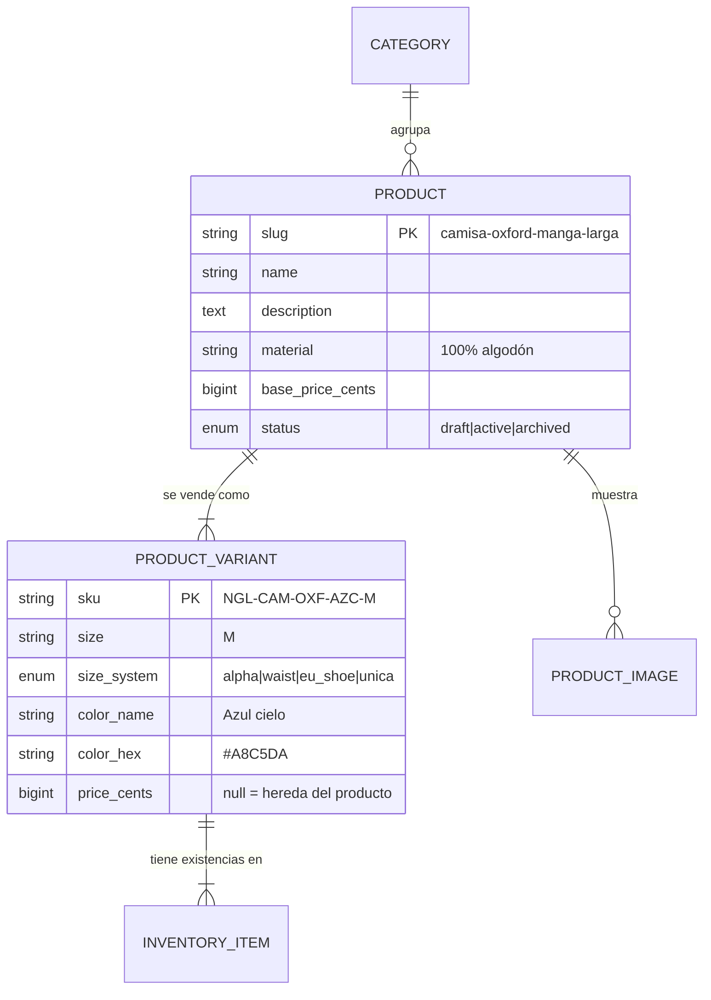

# Catálogo — Producto vs Variante

> Esta es la distinción que decide si el resto del sistema funciona. Si se colapsa
> Producto y Variante en una sola tabla, el inventario se vuelve imposible de mantener.

## El problema concreto

Nogal vende una camisa Oxford. Existe en 4 colores y 5 tallas: **20 combinaciones**.
Cada combinación tiene su propio stock, su propio código de barras y puede agotarse por
separado. Pero comparte nombre, descripción, material, fotos de composición y categoría.

Si modelamos una fila por combinación, la descripción se duplica 20 veces y corregir una
falta de ortografía son 20 `UPDATE`. Si modelamos una sola fila, no hay dónde guardar que
quedan 3 unidades de la azul talla M.

## La separación

**Producto** = lo que el cliente busca y lee.
**Variante** = lo que el cliente compra y el almacén cuenta.

## Reglas del catálogo

1. Un producto `active` **debe** tener al menos una variante `active`. Un producto sin
   variantes vendibles no aparece en el listado.
2. El `sku` es único globalmente y **no se reutiliza jamás**, ni tras archivar la variante.
   Si se reutiliza, el histórico de pedidos empieza a mentir.
3. `Product.slug` es único y es lo que va en la URL pública. Se genera del nombre y se
   congela: cambiar el nombre no cambia el slug (rompería enlaces).
4. El precio efectivo de una variante es
   `variant.price_cents ?? product.base_price_cents`. Se resuelve en el servidor, nunca
   en el cliente.
5. Archivar un producto (`status = archived`) lo saca del catálogo pero **no lo borra**.
   Hay pedidos que lo referencian. Se usa `SoftDeletes` solo para errores de captura.

## Catálogo inicial de Nogal

| Categoría | slug | Sistema de tallas | Productos de arranque |
|---|---|---|---|
| Camisas | `camisas` | `alpha` | Oxford manga larga, Lino cuello mao, Franela cuadros |
| Camisetas | `camisetas` | `alpha` | Cuello redondo peso pesado, Henley manga larga |
| Pantalones | `pantalones` | `waist` | Chino slim, Jean recto 14oz, Pantalón de vestir lana fría |
| Chaquetas | `chaquetas` | `alpha` | Bomber, Trucker de mezclilla, Gabardina corta |
| Calzado | `calzado` | `eu_shoe` | Bota Chelsea cuero, Zapatilla minimalista |
| Accesorios | `accesorios` | `unica` | Cinturón cuero, Corbata de lana, Medias (pack 3) |

## Filtros que el catálogo debe soportar

Salen de aquí y se contratan en `docs/api/contracts/01-products.md`:

| Filtro | Se aplica sobre | Nota de implementación |
|---|---|---|
| `category` | `products.category_id` vía slug | índice en `category_id, status` |
| `size` | `product_variants.size` | requiere `whereHas`, ojo con N+1 |
| `color` | `product_variants.color_name` | normalizado a minúsculas sin tildes |
| `price_min` / `price_max` | precio efectivo | **subconsulta**: el precio puede estar en la variante o en el producto |
| `q` | `name` + `description` | `LIKE` en el MVP; ADR-0009 pospone el buscador real |
| `in_stock` | `available > 0` en alguna variante | el filtro más caro; documentado en el contrato |

El filtro `price_min`/`price_max` es el que se rompe siempre: si consultas solo
`products.base_price_cents` ignoras las variantes con precio propio y devuelves resultados
incorrectos. Hay que usar `COALESCE(variant.price_cents, product.base_price_cents)`.
