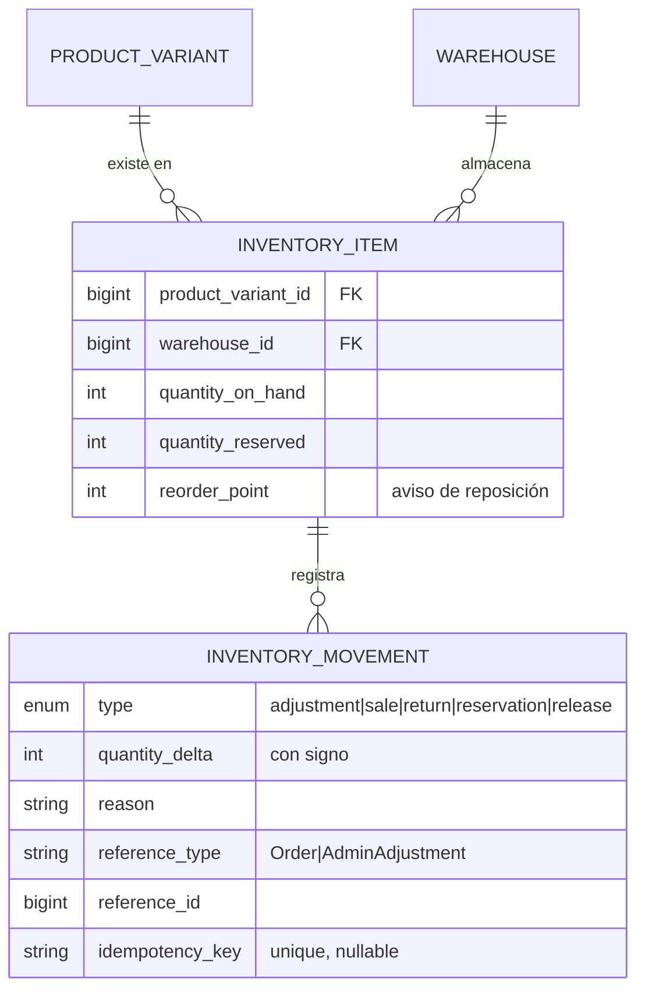

# Inventario

> Responde a la pregunta 6 de la evaluación: **el inventario es la parte más sensible a
> inconsistencias del sistema**, porque es el único dato compartido entre peticiones
> concurrentes que no puede reconstruirse a partir de otro.

## Las tres cantidades

| Cantidad | Naturaleza | Cómo cambia |
|---|---|---|
| `quantity_on_hand` | columna | Ajustes de admin, recepciones, despachos |
| `quantity_reserved` | columna | Al crear un pedido sube; al despachar o cancelar baja |
| `available` | **calculado** | `on_hand - reserved`. Nunca se guarda. |

`available` no es una columna a propósito. Si lo fuera, sería un tercer dato que puede
desincronizarse de los otros dos, y no hay forma de saber cuál de los tres miente.

## Existencias por variante y almacén



`UNIQUE(product_variant_id, warehouse_id)`. Sin esa restricción aparecen filas duplicadas
para la misma variante y el stock se cuenta dos veces.

## El libro mayor: `inventory_movements`

**Append-only. Nunca se actualiza, nunca se borra.**

Toda modificación de `quantity_on_hand` o `quantity_reserved` genera su movimiento en la
misma transacción. La consecuencia práctica:

```
SUM(quantity_delta) WHERE type IN (adjustment, sale, return) == quantity_on_hand
```

Si esa igualdad no se cumple, hay un `UPDATE` en el código que se saltó el libro mayor.
Es un test de invariante del proyecto, no una recomendación.

| Tipo | Delta | Cuándo |
|---|---|---|
| `adjustment` | ± | Admin corrige, recibe mercancía o registra merma |
| `reservation` | − sobre `reserved` (sube reserved) | Se crea un pedido |
| `release` | + sobre `reserved` (baja reserved) | Se cancela un pedido |
| `sale` | − sobre `on_hand` y `reserved` | Se despacha el pedido |
| `return` | + sobre `on_hand` | Devolución aceptada |

## Concurrencia: el problema real

Dos clientes piden la última camisa talla M al mismo tiempo.

```
Petición A                          Petición B
SELECT available -> 1
                                    SELECT available -> 1
"hay stock, sigo"
                                    "hay stock, sigo"
UPDATE reserved = 1
                                    UPDATE reserved = 2   <-- vendimos 2 de 1
```

Esto se llama *lost update* y se produce siempre que se lee y se escribe sin bloqueo.
No es teórico: en un lanzamiento con 200 personas esperando, ocurre.

**Nuestra defensa (ADR-0006):**

1. `DB::transaction()` envolviendo toda la creación de pedido.
2. `lockForUpdate()` sobre las filas de `inventory_items` implicadas, **ordenadas por
   `id` ascendente**. El orden fijo evita interbloqueos cuando dos pedidos comparten
   variantes en distinto orden.
3. `CHECK (quantity_reserved <= quantity_on_hand)` a nivel de base de datos como última
   red. Si el código falla, la base de datos rechaza la escritura.

La red de la base de datos importa: un bloqueo se puede olvidar en una refactorización
dentro de seis meses, la restricción no.

## Qué NO hace el MVP

**No hay reservas temporales con caducidad** (ADR-0005). Añadir al carrito **no** reserva
stock. El stock se compromete únicamente al crear el pedido. Consecuencia aceptada: puedes
tener algo en el carrito 20 minutos y descubrir al confirmar que se agotó. Devolvemos
`INSUFFICIENT_STOCK` con el detalle de qué línea falló y cuánto queda.

Es peor experiencia que reservar, y es lo correcto para un catálogo pequeño: reservar
implica un proceso de expiración, cron, y stock fantasma bloqueado por carritos
abandonados. Se retoma cuando haya lanzamientos con demanda concentrada.
