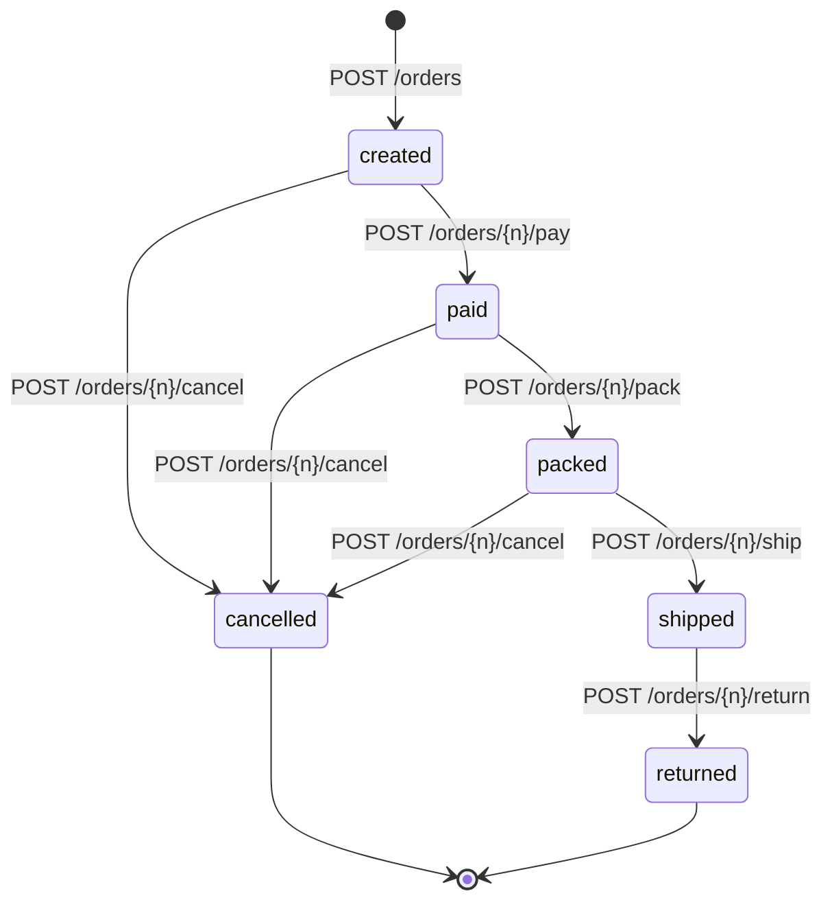

# Pedidos y máquina de estados

## Qué es un pedido

Un compromiso de compra **inmutable en su contenido**. Una vez creado no se le añaden ni
se le quitan líneas: lo único que cambia es su `status`. Si el cliente quiere otra cosa,
se cancela y se crea otro.

Esto simplifica el sistema entero. Un pedido editable exige recalcular stock, totales e
historial en cada modificación, y cada recálculo es una oportunidad de inconsistencia.

## Número público

`NGL-2026-000123` — prefijo de marca, año, secuencia con relleno de ceros. Es lo que va
en la URL, en el correo y en lo que el cliente dice por teléfono. El `id` autoincremental
nunca sale de la base de datos.

## Copia histórica de las líneas

`order_items` guarda **texto plano**, no solo la referencia:

| Columna | Valor | Naturaleza |
|---|---|---|
| `product_variant_id` | 482 | referencia, puede quedar huérfana |
| `sku` | `NGL-CAM-OXF-AZC-M` | copiado |
| `product_name` | `Camisa Oxford Manga Larga` | copiado |
| `variant_label` | `Azul cielo / M` | copiado |
| `unit_price_cents` | `18900` | copiado |

Si en 2027 se renombra el producto o se archiva la variante, el pedido de 2026 debe seguir
diciendo lo que el cliente compró. Un pedido que muestra el nombre actual del producto es
un pedido que miente sobre el pasado.

## Estados

## Tabla de transiciones

Esta tabla es la especificación. `OrderStatus::canTransitionTo()` la implementa literal.

| Desde \ Hacia | created | paid | packed | shipped | cancelled | returned |
|---|:---:|:---:|:---:|:---:|:---:|:---:|
| **created**   | — | SI | NO | NO | SI | NO |
| **paid**      | NO | — | SI | NO | SI | NO |
| **packed**    | NO | NO | — | SI | SI | NO |
| **shipped**   | NO | NO | NO | — | NO | SI |
| **cancelled** | NO | NO | NO | NO | — | NO |
| **returned**  | NO | NO | NO | NO | NO | — |

Cualquier `NO` devuelve `409 INVALID_STATE_TRANSITION` con `details` indicando el estado
actual y las transiciones legales desde ahí.

Tres decisiones que se leen en la tabla:

- **No se puede cancelar un pedido `shipped`.** Ya salió del almacén. Lo que existe es
  `returned`, que es un proceso distinto y con efecto contrario sobre el stock.
- **`cancelled` y `returned` son terminales.** No hay "reactivar". Se crea un pedido nuevo.
- **No se puede saltar de `created` a `shipped`.** Aunque en el mundo real alguien despache
  sin registrar el pago, permitirlo aquí significa que el estado deja de ser fiable.

## Efecto de cada transición sobre el stock

Esta columna es la que hay que leer junto con `docs/domain/02-inventario.md`:

| Transición | `on_hand` | `reserved` | Movimiento generado |
|---|---|---|---|
| crear pedido, queda en `created` | sin cambio | **+cantidad** | `reservation` |
| `created` a `paid` | sin cambio | sin cambio | ninguno |
| `paid` a `packed` | sin cambio | sin cambio | ninguno |
| `packed` a `shipped` | **-cantidad** | **-cantidad** | `sale` |
| cualquiera a `cancelled` | sin cambio | **-cantidad** | `release` |
| `shipped` a `returned` | **+cantidad** | sin cambio | `return` |

El stock físico solo se descuenta al **despachar**, no al pagar. Mientras el paquete está
en el almacén, la unidad sigue existiendo: está reservada, no vendida. Confundir estos dos
momentos es el motivo más frecuente de descuadres de inventario.

## Creación del pedido: la operación crítica

Todo dentro de una única transacción:

1. Cargar el carrito con `lockForUpdate()`; verificar que está `open` y no vacío.
2. Cargar los `inventory_items` de todas las variantes con `lockForUpdate()`,
   **ordenados por `id` ascendente** (evita interbloqueos).
3. Validar `available >= quantity` en **todas** las líneas. Si alguna falla, abortar la
   transacción entera y devolver `409 INSUFFICIENT_STOCK` con el detalle línea por línea.
   No hay pedidos parciales.
4. Crear `orders` con totales congelados; crear `order_items` copiando los textos.
5. Subir `quantity_reserved` y escribir un movimiento `reservation` por línea.
6. Marcar el carrito como `converted`.
7. Guardar la respuesta bajo la clave de idempotencia.

Si algo revienta en el paso 5, el `rollback` deshace también el paso 4. Esa atomicidad es
la razón de que todo esté en una sola transacción y no en varias.

## Idempotencia

`POST /api/v1/orders` **exige** el header `Idempotency-Key` (ULID o UUID del cliente).
Sin él: `400 IDEMPOTENCY_KEY_REQUIRED`.

- Primera vez con esa clave: se procesa y se guarda `(status, body)` en `idempotency_keys`.
- Repetición con la **misma clave y el mismo cuerpo**: se devuelve la respuesta guardada,
  con el header `Idempotency-Replayed: true`. No se crea un segundo pedido.
- Misma clave con **cuerpo distinto**: `409 IDEMPOTENCY_KEY_REUSED`. Es un bug del
  cliente y hay que hacerlo ruidoso, no adivinar cuál de las dos peticiones vale.

Sin esto, un doble clic o un reintento por timeout de red crea dos pedidos y reserva el
stock dos veces. Es el ADR más importante del proyecto (ADR-0004).
