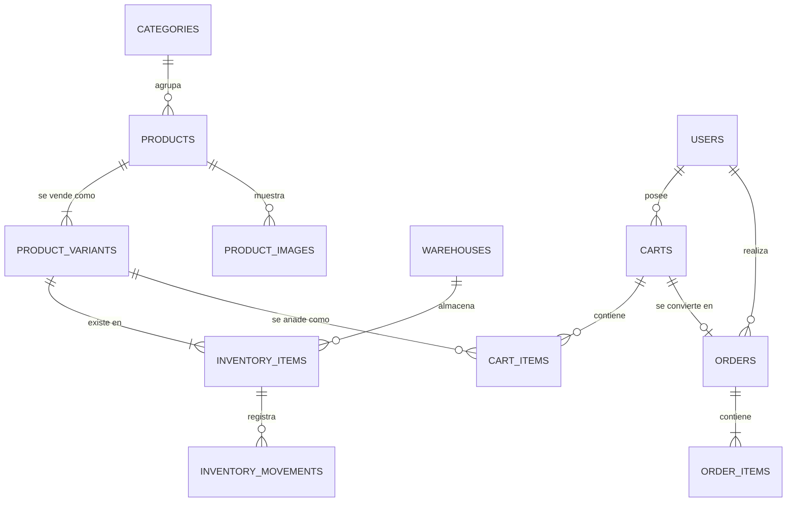

# Modelo de datos

## Diagrama entidad-relación completo



## Las 12 tablas

| # | Tabla | Filas esperadas | Índices clave |
|---|---|---|---|
| 1 | `categories` | ~10 | `slug` unique |
| 2 | `products` | ~200 | `slug` unique, `(status, category_id)` |
| 3 | `product_images` | ~800 | `(product_id, position)` |
| 4 | `product_variants` | ~3.000 | `sku` unique, `(product_id, status)` |
| 5 | `warehouses` | 1 a 3 | `code` unique |
| 6 | `inventory_items` | ~3.000 | `(product_variant_id, warehouse_id)` unique |
| 7 | `inventory_movements` | crece sin límite | `(inventory_item_id, created_at)`, `idempotency_key` unique |
| 8 | `carts` | alto, con caducidad | `token` unique, `(status, expires_at)` |
| 9 | `cart_items` | — | `(cart_id, product_variant_id)` unique |
| 10 | `orders` | crece sin límite | `number` unique, `(user_id, created_at)`, `(status, created_at)` |
| 11 | `order_items` | — | `order_id` |
| 12 | `idempotency_keys` | con purga a 24 h | `(key, endpoint)` unique |

## Restricciones que no son negociables

```sql
UNIQUE (product_variants.sku)
UNIQUE (inventory_items.product_variant_id, inventory_items.warehouse_id)
UNIQUE (cart_items.cart_id, cart_items.product_variant_id)
UNIQUE (orders.number)
UNIQUE (idempotency_keys.key, idempotency_keys.endpoint)

CHECK  (inventory_items.quantity_on_hand   >= 0)
CHECK  (inventory_items.quantity_reserved  >= 0)
CHECK  (inventory_items.quantity_reserved  <= inventory_items.quantity_on_hand)
CHECK  (cart_items.quantity BETWEEN 1 AND 20)
```

Las tres `CHECK` de inventario son la red de seguridad de la que habla
`02-inventario.md`: si una refactorización futura olvida un bloqueo, la base de datos
rechaza la escritura en vez de dejar el stock en negativo.

## Convención de tipos

| Concepto | Tipo | Motivo |
|---|---|---|
| Dinero | `unsignedBigInteger` con sufijo `_cents` | exactitud |
| Cantidades | `unsignedInteger` | no existe media camisa |
| Estados | `string` respaldando un Enum de PHP | legible en la base, tipado en el código |
| Identificadores públicos | `string` (`slug`, `sku`, `number`, `token`) | estables y no adivinables |
| Direcciones | `json` | no se consultan por campo en el MVP |
| Fechas | `timestamp` en UTC | la conversión de zona es del cliente |

## Borrado

- `products`, `product_variants`: `SoftDeletes` **solo** para errores de captura.
  Retirar del catálogo es `status = archived`, no borrar.
- `orders`, `order_items`, `inventory_movements`: **nunca se borran**. Son el histórico.
- `carts` caducados: purgables por comando programado a los 90 días.
